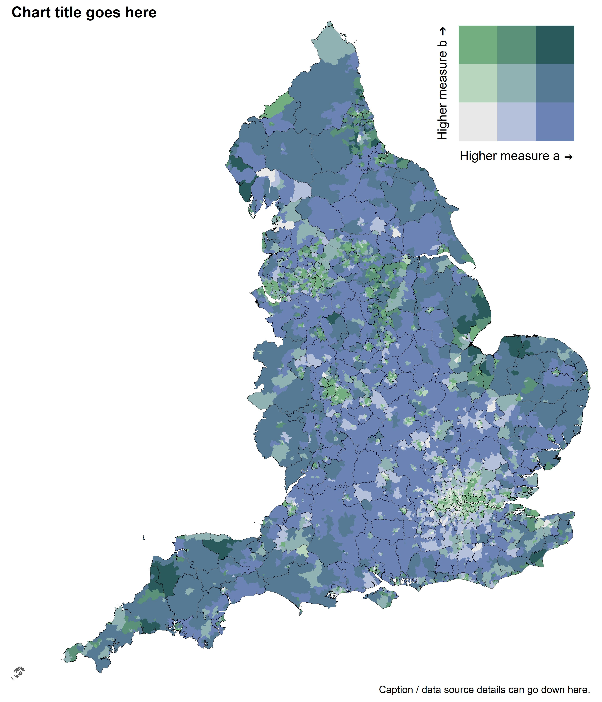

The code below can be used to create a bivariate choropleth map of England.
\
\
The :red_circle: symbol is used where you may need to edit code, download something, or make a choice before running the next code chunk.
\
\
Firstly, install and load the following packages.
```{r message=FALSE, warning=FALSE}
# install.packages("here", type = "binary")
# install.packages("data.table", type = "binary")
# install.packages("janitor", type = "binary")
# install.packages("dplyr", type = "binary")
# install.packages("ggplot2", type = "binary")
# install.packages("sf", type = "binary")
# install.packages("scales", type = "binary")
# install.packages("stringr", type = "binary")
# install.packages("knitr", type = "binary")
# install.packages("cowplot", type = "binary")

library(here) # File path referencing
library(data.table) # Fast reading/writing
library(janitor) # Rounding
library(dplyr) # General data manipulation
library(tidyr) # More general data manipulation
library(ggplot2) # General plotting
library(sf) # Geospatial mapping
library(scales) # Commas for legend
library(stringr) # str_detect()
library(knitr) # include_graphics()
library(cowplot) # extra plotting functions
```
\
:red_circle: Write your own code to read in your data into a tibble called `df_measure` that includes the two columns `area_code`, `measure_a`, and `measure_b`. 
\
In this example, I read coronavirus vaccination data from a csv. You may read your data in from an excel file, api, or something else.
```{r warning=FALSE}
df_measure_bivariate <- fread(here("1 - Data/example_data", "example_data_msoa_bivariate.csv")) %>% 
  tibble()
```
\
:red_circle: Download your own shapefiles from the [ONS Open Geography Portal](https://geoportal.statistics.gov.uk/) and read them in below.
\
\
In this example we'll load in Middle Layer Super Output Areas (MSOA) and Local Authority Districts (LAD).
\
`shape_one` is the area to be filled with colour, whilst `shape_two` will provide the boundary lines. These can be the same.
```{r warning=FALSE}
shape_one <- read_sf(here("1 - Data/shapefiles/MSOAs", "Middle_Layer_Super_Output_Areas__December_2011__Boundaries_Full_Clipped__BFC__EW_V3.shp")) %>% 
  rename(area_code = MSOA11CD)

shape_two <- read_sf(here("1 - Data/shapefiles/LADs", "LAD_DEC_2021_UK_BFC.shp")) %>% 
  rename(area_code = LAD21CD)
```
\
Join the shapefile for `shape_one` with your data:
```{r}
df_measure_shape <- left_join(shape_one, df_measure_bivariate, by = "area_code")
```
\
To set up the England-only filter for the `shape_one` and `shape_two` areas, we can filter to keep codes that start with "E". This works for most things including LSOA, MSOA, LAD, CCG, ICB, Sub-ICB, NHS region, STP, Cancer Alliance, and Strategic Clinical Network.
\
:red_circle: If your `area_code`s for England do not start with "E", you will need to alter the code below before running.
```{r}
shape_one_england <- function(df) {df %>% filter(str_detect(area_code, "^E"))} # Starts with "E"
shape_two_england <- function(df) {df %>% filter(str_detect(area_code, "^E"))} # Starts with "E"
```
\
Check to see which, if any, areas have missing data.
\
More missing than expected? You may have chosen the wrong shapefile.
```{r}
df_measure_shape %>% 
  tibble() %>% 
  shape_one_england %>% 
  filter(is.na(measure_a) | is.na(measure_b)) %>% 
  select(area_code, measure_a, measure_b)
```
\


:red_circle: Edit the legend axis labels in `labs()`
```{r}
# Colours from viridis, change to pal brewer.seqseq2 or brewer.greenblue ?
# https://kwstat.github.io/pals/reference/bivariate.html
bivariate_palette = c(
  "#E8F4F3", # low x, low y
  "#DDF2C0", # low x, med y
  "#FEF287", # low x, high y
  "#C2BDD6", # med x, low y
  "#85C2C0", # med x, med y
  "#72CF8E", # med x, high y
  "#9874A1", # high x, low y
  "#6380A6", # high x, med y
  "#21908D", # high x, high y
  "grey80"   # Missing data
)

df <- tibble(
  x = c(1, 1, 1, 2, 2, 2, 3, 3, 3),
  y = c(1:3, 1:3, 1:3),
  bivariate_grouping = factor(1:9)
)

legend_bivariate <- df %>% 
  ggplot(aes(x, y, fill = bivariate_grouping)) + 
  geom_tile() + 
  scale_fill_manual(values = bivariate_palette) + 
  labs(
    x = paste("Higher measure a", sprintf("\u2794")),
    y = paste("Higher measure b", sprintf("\u2794")),
  ) + 
  coord_fixed() + 
  theme(
    legend.position = "none",
    axis.text = element_blank(),
    axis.ticks = element_blank(),
    panel.background = element_blank(),
    axis.title = element_text(size = 18, family = "sans")
  )
```


```{r}
source(here("2 - Templates", "extra_scripts", "scale_bivariate.R"))
```
\

\
```{r}
boundary_colour <- "black"

p_map <- df_grouped %>%
  shape_one_england() %>%
  ggplot() +
  geom_sf(
    aes(geometry = geometry, fill = fill_grouped), 
    colour = NA) +
  geom_sf(
    data = shape_two %>% shape_two_england,
          aes(geometry = geometry),
          fill = NA,
          size = 0.1,
          colour = boundary_colour
    ) +
  fill_scale_bivariate +
  coord_sf(expand = FALSE, clip = "off") +
  labs(
    title = "Chart title goes here",
    fill = "Legend title goes here",
    caption = "Caption / data source details can go down here."
  ) +
  theme_void(base_size = 18, base_family = "sans") +
  theme(legend.position = "none",
        plot.margin = margin(0, 10, 10, 10),
        plot.title = element_text(face = "bold"),
        plot.title.position = "plot")

p_map_legend <- ggdraw() + 
  draw_plot(p_map, 0, 0, 1, 1) + 
  draw_plot(legend_bivariate, 0.03, 0.331, 0.25)

ggsave(p_map_legend, dpi = 300, width = 12, height = 14, units = "in",
       filename = here("2 - Templates", "output_vis", "choropleth_2area_bivariate.jpeg"))
```

