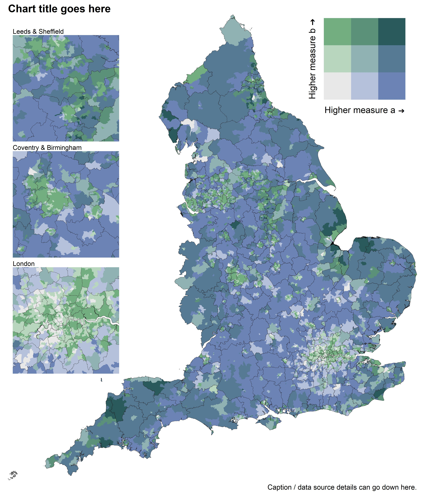

Bivariate choropleth map of England
================

The code below can be used to create a bivariate choropleth map of
England, with optional zoomed in areas of interest.  
  
The :red\_circle: symbol is used where you may need to edit code,
download something, or make a choice before running the next code
chunk.  
  
Firstly, install and load the following packages.

``` r
options(pkgType = "binary")
if (!require("pacman")) install.packages("pacman")

pacman::p_load(
  here, # File path referencing
  readr, # Reading data
  janitor, # Rounding
  dplyr, # General data manipulation
  tidyr, # More general data manipulation
  ggplot2, # General plotting
  sf, # Geospatial mapping
  scales, # Commas for legend
  stringr, # str_detect()
  knitr, # include_graphics()
  cowplot, # Extra plotting functions
  ggpattern # Plot patterns for missing data
)
```

  
:red\_circle: Write your own code to read in your data into a tibble
called `df_measure` that includes the two columns `area_code`,
`measure_a`, and `measure_b`.  
In this example, I read coronavirus vaccination data from a csv. You may
read your data in from an excel file, api, or something else.

``` r
df_measure_bivariate <- read_csv(here("1 - Data/example_data", "example_data_msoa_bivariate.csv"))
```

  
:red\_circle: Download your own shapefiles from the [ONS Open Geography
Portal](https://geoportal.statistics.gov.uk/) and read them in below.  
  
In this example we’ll load in Middle Layer Super Output Areas (MSOA) and
Local Authority Districts (LAD).  
`shape_one` is the area to be filled with colour, whilst `shape_two`
will provide the boundary lines. These can be the same.

``` r
shape_one <- read_sf(here("1 - Data/shapefiles/MSOAs", "Middle_Layer_Super_Output_Areas__December_2011__Boundaries_Full_Clipped__BFC__EW_V3.shp")) %>% 
  rename(area_code = MSOA11CD)

shape_two <- read_sf(here("1 - Data/shapefiles/LADs", "LAD_DEC_2021_UK_BFC.shp")) %>% 
  rename(area_code = LAD21CD)
```

  
Join the shapefile for `shape_one` with your data:

``` r
df_measure_shape <- left_join(shape_one, df_measure_bivariate, by = "area_code")
```

  
To set up the England-only filter for the `shape_one` and `shape_two`
areas, we can filter to keep codes that start with “E”. This works for
most things including LSOA, MSOA, LAD, CCG, ICB, Sub-ICB, NHS region,
STP, Cancer Alliance, and Strategic Clinical Network.  
:red\_circle: If your `area_code`s for England do not start with “E”,
you will need to alter the code below before running.

``` r
shape_one_england <- function(df) {df %>% filter(str_detect(area_code, "^E"))} # Starts with "E"
shape_two_england <- function(df) {df %>% filter(str_detect(area_code, "^E"))} # Starts with "E"
```

  
Check to see which, if any, areas have missing data.  
More missing than expected? You may have chosen the wrong shapefile.

``` r
df_measure_shape %>% 
  tibble() %>% 
  shape_one_england %>% 
  filter(is.na(measure_a) | is.na(measure_b)) %>% 
  select(area_code, measure_a, measure_b)
```

    ## # A tibble: 1 x 3
    ##   area_code measure_a measure_b
    ##   <chr>         <dbl>     <dbl>
    ## 1 E02006781        NA        NA

  
:red\_circle: Choose a bivariate colour palette. The following are
colourblind-accessible palettes.

``` r
# Palette from stevens.greenblue
bivariate_palette <- c(
  "#E8E8E8", # low a, low b
  "#B8D6BE", # low a, med b
  "#73AE80", # low a, high b
  "#B5C0DA", # med a, low b
  "#90B2B3", # med a, med b
  "#5A9178", # med a, high b
  "#6C83B5", # high a, low b
  "#567994", # high a, med b
  "#2A5A5B", # high a, high b
  "grey80"   # Missing data
)

# Palette from viridis
# bivariate_palette <- c("#E8F4F3", "#DDF2C0", "#FEF287", "#C2BDD6", "#85C2C0", "#72CF8E", "#9874A1", "#6380A6", "#21908D", "grey80")

# Palette from brewer.seqseq2 (use white borders)
# bivariate_palette <- c("#F3F3F3", "#F3E6B3", "#F3B300", "#B4D3E1", "#B3B3B3", "#B36600", "#509DC2", "#376387", "#000000", "grey80")
```

  
Now we can using the [scale\_bivariate
function](https://github.com/DataS-DHSC/geospatial-vis-templates/tree/master/2%20-%20Templates/extra_scripts/scale_bivariate.R)
which automatically generates a bivariate scale for the fill legend.  
:red\_circle: Change the legend labels in `measure_a_label` and
`measure_b_label`.

``` r
source(here("2 - Templates", "extra_scripts", "scale_bivariate.R"))

df_grouped <- scale_bivariate(
  df_measure_shape,
  measure_a_label = "Higher measure a", 
  measure_b_label = "Higher measure b"
)
```

  
Now it’s time to plot a choropleth map of England.  
:red\_circle: You can change the text in `labs()`, change or remove the
boundary line colour with `boundary_line`, and change the file name in
`ggsave()`.  

``` r
boundary_colour <- "black"

p_map <- df_grouped %>%
  shape_one_england() %>%
  ggplot() +
  geom_sf(
    aes(fill = fill_grouped), 
    colour = NA
    ) +
  geom_sf(
    data = shape_two %>% shape_two_england,
    fill = NA,
    size = 0.1,
    colour = boundary_colour
  ) +
  geom_sf_pattern(
    data = . %>% filter(fill_grouped == "Missing data"),
    aes(fill = fill_grouped),
    pattern_colour = "grey60",
    pattern_fill = "grey60",
    pattern = "stripe",
    pattern_density = 0.0004,
    pattern_spacing = 0.004,
    pattern_angle = 45,
    pattern_res = 300
  ) +
  fill_scale_final +
  coord_sf(expand = FALSE, clip = "off") +
  labs(
    title = str_wrap("Chart title goes here", width = 80),
    caption = str_wrap("Caption / data source details can go down here.", width = 80)
  ) +
  theme_void(base_size = 18, base_family = "sans") +
  theme(
    legend.position = "none",
    plot.margin = margin(0, 10, 10, 10),
    plot.title = element_text(face = "bold"),
    plot.title.position = "plot"
  )

p_map_legend <- ggdraw() + 
  draw_plot(p_map, 0, 0, 1, 1) + 
  draw_plot(legend_bivariate, 0.72, 0.37, 0.25)

ggsave(p_map_legend, dpi = 300, width = 12, height = 14, units = "in",
       filename = here("2 - Templates", "output_vis", "choropleth_2area_bivariate.jpeg"))
```

  
We can also include zoomed in areas for locations of interest by using
the [zoom\_plot
function](https://github.com/DataS-DHSC/geospatial-vis-templates/tree/master/2%20-%20Templates/extra_scripts/zoom_plot.R).

``` r
source(here("2 - Templates", "extra_scripts", "zoom_plot.R"))
```

  
Now we can add in locations with coordinates of the areas of interest.  
:red\_circle: Change the zoomed locations for the top, middle and bottom
windows in `p_top`, `p_middle`, and `p_bottom`, respectively.

``` r
locations <- tibble(
  `London` =  c(505000, 555000, 155000, 205000),
  `Liverpool & Manchester` = c(320000, 410000, 375000, 425000),
  `Leeds & Sheffield` = c(400000, 470000, 370000, 440000),
  `Coventry & Birmingham` = c(380000, 450000, 250000, 320000),
  `Cambridge` = c(500000, 570000, 220000, 290000),
  `Oxford` = c(420000, 490000, 170000, 240000),
  `Bristol` = c(310000, 380000, 140000, 210000)
  )

p_top <- zoom_plot("Leeds & Sheffield", locations$`Leeds & Sheffield`)
p_middle <- zoom_plot("Coventry & Birmingham", locations$`Coventry & Birmingham`)
p_bottom <- zoom_plot("London", locations$`London`)
```

  
Finally, we can plot the different areas together.  
:red\_circle: Again, you can change the file name in `ggsave()`.

``` r
p_map_zoom <- ggdraw() + 
  draw_plot(p_map, 0, 0, 1, 1) + 
  draw_plot(legend_bivariate, 0.72, 0.37, 0.25) + 
  draw_plot(p_top, 0.03, 0.331, 0.25) + 
  draw_plot(p_middle, 0.03, 0.097, 0.25) + 
  draw_plot(p_bottom, 0.03, -0.137, 0.25)

ggsave(p_map_zoom, dpi = 300, width = 12, height = 14, units = "in",
       filename = here("2 - Templates", "output_vis", "choropleth_bivariate_zoom.jpeg"))
```


