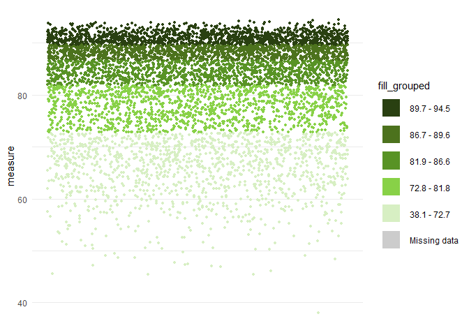

Static choropleth map of England
================

The code below can be used to create a static choropleth map of England,
with optional zoomed in areas of interest.  
  
The :red\_circle: symbol is used where you may need to edit code,
download something, or make a choice before running the next code
chunk.  
  
Firstly, install and load the following packages.

``` r
# install.packages("here", type = "binary")
# install.packages("data.table", type = "binary")
# install.packages("janitor", type = "binary")
# install.packages("dplyr", type = "binary")
# install.packages("ggplot2", type = "binary")
# install.packages("sf", type = "binary")
# install.packages("scales", type = "binary")
# install.packages("stringr", type = "binary")
# install.packages("knitr", type = "binary")
# install.packages("cowplot", type = "binary")

library(here) # File path referencing
library(data.table) # Fast reading/writing
library(janitor) # Rounding
library(dplyr) # General data manipulation
library(tidyr) # More general data manipulation
library(ggplot2) # General plotting
library(sf) # Geospatial mapping
library(scales) # Commas for legend
library(stringr) # str_detect()
library(knitr) # include_graphics()
library(cowplot) # extra plotting functions
```

  
:red\_circle: Read in your data to make a tibble called `df_measure`
that includes the two columns `area_code` and `measure`. In this example
I take data from an api for coronavirus data.

``` r
df_measure <- fread("https://api.coronavirus.data.gov.uk/v2/data?areaType=msoa&metric=cumVaccinationFirstDoseUptakeByVaccinationDatePercentage&format=csv") %>% 
  distinct() %>% 
  group_by(areaCode) %>% 
  filter(date == max(date)) %>% 
  rename(area_code = areaCode,
         measure = cumVaccinationFirstDoseUptakeByVaccinationDatePercentage)
```

  
:red\_circle: Download your own shapefiles from the [ONS Open Geography
Portal](https://geoportal.statistics.gov.uk/) and read them in below.  
  
In this example we’ll load in Middle Layer Super Output Areas (MSOA) and
Local Authority Districts (LAD).  
`shape_one` is the area to be filled with colour, whilst `shape_two`
will provide the boundary lines. These can be the same.

``` r
shape_one <- read_sf(here("1 - Data/shapefiles/MSOAs", "Middle_Layer_Super_Output_Areas__December_2011__Boundaries_Full_Clipped__BFC__EW_V3.shp")) %>% 
  rename(area_code = MSOA11CD)

shape_two <- read_sf(here("1 - Data/shapefiles/LADs", "LAD_DEC_2021_UK_BFC.shp")) %>% 
  rename(area_code = LAD21CD)
```

  
Join the shapefile for `shape_one` with your data:

``` r
df_measure_shape <- left_join(shape_one, df_measure, by = "area_code")
```

  
To set up the England-only filter for the `shape_one` and `shape_two`
areas, we can filter to keep codes that start with “E”. This works for
most things including LSOA, MSOA, LAD, CCG, ICB, Sub-ICB, NHS region,
STP, Cancer Alliance, and Strategic Clinical Network.  
:red\_circle: If your `area_code`s for England do not start with “E”,
you will need to alter the code below before running.

``` r
shape_one_england <- function(df) {df %>% filter(str_detect(area_code, "^E"))} # Starts with "E"
shape_two_england <- function(df) {df %>% filter(str_detect(area_code, "^E"))} # Starts with "E"
```

  
Now we need to make the `fill_grouped` column to split the measure into
groups for the fill legend…  
  
:red\_circle: If your measure is continuous or count data, you can use
the [scale\_gen
function](https://github.com/DataS-DHSC/geospatial-vis-templates/tree/master/2%20-%20Templates/extra_scripts/scale_gen.R)
which automatically generate quintiles for the fill legend. Choose the
`round_to` and `decimal_places` values depending on the type of data
you’re using.

``` r
source(here("2 - Templates", "extra_scripts", "scale_gen.R"))

df_grouped <- scale_gen(
  round_to = 0.1, # Denomination to round to (min/max not rounded)
  decimal_places = 1 # Decimal places to round to (0 for count data)
)

levels(df_grouped$fill_grouped)
```

    ## [1] "89.7 - 94.5"  "86.7 - 89.6"  "81.9 - 86.6"  "72.8 - 81.8"  "38.1 - 72.7" 
    ## [6] "Missing data"

  
:red\_circle: If your measure is already grouped into categories, name
the column `fill_grouped`, make sure to fill any NAs in with the text
“Missing data”, call the tibble `df_grouped`, then edit the hex colour
codes in `fill_palette` below to suit. The number of colours must match
the number of categories in `fill_grouped`, including missing data.  
  
If you used `scale_gen()`, just run the follow code chunk without
changing anything.

``` r
fill_palette <- c(
  "#294011", # Q5 (Highest values)
  "#4C721D", # Q4
  "#589325", # Q3
  "#88D147", # Q2
  "#D7EFC3", # Q1 (Lowest values)
  "grey80" # For missing data
  )

names(fill_palette) <- levels(df_grouped$fill_grouped)
fill_scale_final <- scale_fill_manual(values = fill_palette)

df_map <- df_grouped %>% mutate(fill_final = fill_grouped)

# Test legend colours are correct, along with general distribution of the measure
df_grouped %>% 
  ggplot(aes(1, measure, fill = fill_grouped)) + 
  geom_jitter(
    height = 0,
    shape = 21, 
    size = 1.5,
    stroke = 0,
    colour = "transparent"
  ) + 
  theme_minimal() + 
  theme(
    axis.title.x = element_blank(),
    axis.text.x = element_blank(),
    axis.ticks.x = element_blank(),
    panel.grid.major.x = element_blank(),
    panel.grid.minor.x = element_blank()
  ) + 
  guides(fill = guide_legend(override.aes = list(size = 10, shape = 22))) + 
  fill_scale_final
```

<!-- -->  
Now it’s time to plot a choropleth map of England.  
:red\_circle: You can change the text in `labs()`, and the file name in
`ggsave()`.

``` r
p_map <- df_map %>%
  shape_one_england() %>%
  ggplot() +
  geom_sf(aes(geometry = geometry,
              fill = fill_final),
          colour = NA) +
  geom_sf(data = shape_two %>% shape_two_england,
          aes(geometry = geometry),
          fill = NA,
          colour = "black",
          size = 0.1) +
  fill_scale_final +
  coord_sf(expand = FALSE,
           clip = "off") +
  labs(
    title = "Chart title goes here",
    fill = "Legend title goes here",
    caption = "Caption / data source details can go down here."
  ) +
  theme_void(base_size = 18,
             base_family = "sans") +
  theme(legend.position = c(0.84, 0.93),
        plot.margin = margin(0, 10, 10, 10),
        plot.title = element_text(face = "bold"),
        plot.title.position = "plot")

ggsave(p_map, dpi = 300, width = 12, height = 14, units = "in",
       filename = here("2 - Templates", "output_vis", "choropleth_2area.jpeg"))
```

  
We can also include zoomed in areas for locations of interest by using
the [zoom\_plot
function](https://github.com/DataS-DHSC/geospatial-vis-templates/tree/master/2%20-%20Templates/extra_scripts/zoom_plot.R).

``` r
source(here("2 - Templates", "extra_scripts", "zoom_plot.R"))
```

  
Now we can add in locations with coordinates of the areas of interest.  
:red\_circle: Change the zoomed locations for the top, middle and bottom
windows in `p_top`, `p_middle`, and `p_bottom`, respectively.

``` r
locations <- tibble(
  `London` =  c(505000, 555000, 155000, 205000),
  `Liverpool & Manchester` = c(320000, 410000, 375000, 425000),
  `Leeds & Sheffield` = c(400000, 470000, 370000, 440000),
  `Coventry & Birmingham` = c(380000, 450000, 250000, 320000),
  `Cambridge` = c(500000, 570000, 220000, 290000),
  `Oxford` = c(420000, 490000, 170000, 240000),
  `Bristol` = c(310000, 380000, 140000, 210000)
  )

p_top <- zoom_plot("Leeds & Sheffield", locations$`Leeds & Sheffield`)
p_middle <- zoom_plot("Coventry & Birmingham", locations$`Coventry & Birmingham`)
p_bottom <- zoom_plot("London", locations$`London`)
```

  
Finally, we can plot the different areas together.  
:red\_circle: Again, you can change the file name in `ggsave()`.

``` r
p_map_zoom <- ggdraw() + 
  draw_plot(p_map, 0, 0, 1, 1) + 
  draw_plot(p_top, 0.03, 0.331, 0.25) + 
  draw_plot(p_middle, 0.03, 0.097, 0.25) + 
  draw_plot(p_bottom, 0.03, -0.137, 0.25)

ggsave(p_map_zoom, dpi = 300, width = 12, height = 14, units = "in",
       filename = here("2 - Templates", "output_vis", "choropleth_2area_zoom.jpeg"))
```


