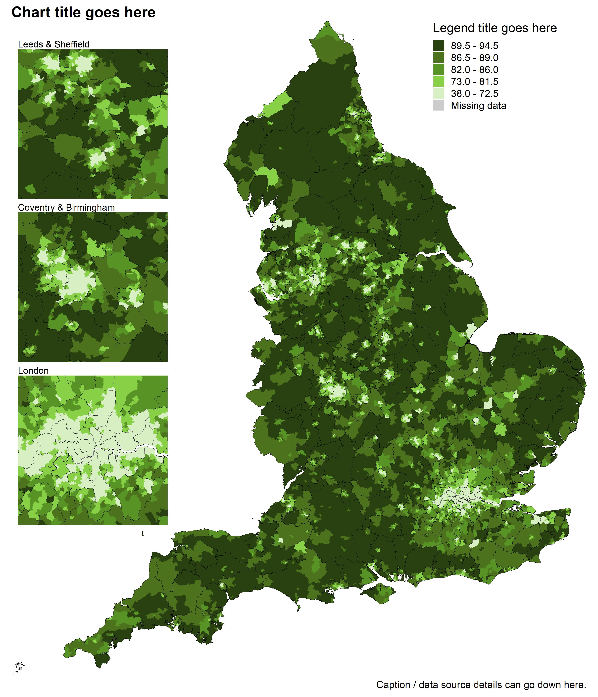

Static choropleth map example
================

The example code below can be used to create a static choropleth map of
England, with optional zoomed in areas for London, the north east and
north west.  
  
The **\[User\]** flag is used where you may need to edit code, download
something, or make a choice before running the next code chunk.  
  
Firstly, install and the following packages

``` r
# install.packages("here", type = "binary")
# install.packages("data.table", type = "binary")
# install.packages("janitor", type = "binary")
# install.packages("dplyr", type = "binary")
# install.packages("ggplot2", type = "binary")
# install.packages("sf", type = "binary")
# install.packages("scales", type = "binary")
# install.packages("stringr", type = "binary")
# install.packages("knitr", type = "binary")
# install.packages("cowplot", type = "binary")

library(here) # File path referencing
library(data.table) # Fast reading/writing
library(janitor) # Rounding
library(dplyr) # General data manipulation
library(ggplot2) # General plotting
library(sf) # Geospatial mapping
library(scales) # Commas for legend
library(stringr) # str_detect()
library(knitr) # include_graphics()
library(cowplot) # extra plotting functions
```

  
**\[User\]** Read in your data to make a tibble called `df_measure` that
includes the two columns `area_code` and `measure`. In this example I
take data from an api for coronavirus data.

``` r
df_measure <- fread("https://api.coronavirus.data.gov.uk/v2/data?areaType=msoa&metric=cumVaccinationFirstDoseUptakeByVaccinationDatePercentage&format=csv") %>% 
  distinct() %>% 
  group_by(areaCode) %>% 
  filter(date == max(date)) %>% 
  rename(area_code = areaCode,
         measure = cumVaccinationFirstDoseUptakeByVaccinationDatePercentage)
```

  
**\[User\]** Download your own shapefiles from the
[geoportal](https://geoportal.statistics.gov.uk/) and put them into the
“1 - Data/shapefiles/” folder.  
  
In this example we’ll load in Middle Layer Super Output Areas (MSOA) and
Local Authority Districts (LAD).  
`shape_one` is the area to be filled with colour, whilst `shape_two`
will provide the boundary lines. These can be the same.

``` r
shape_one <- read_sf(here("1 - Data/shapefiles/MSOAs", "Middle_Layer_Super_Output_Areas__December_2011__Boundaries_Full_Clipped__BFC__EW_V3.shp")) %>% 
  rename(area_code = MSOA11CD)

shape_two <- read_sf(here("1 - Data/shapefiles/LADs", "LAD_DEC_2021_UK_BFC.shp")) %>% 
  rename(area_code = LAD21CD)
```

  
Join the shapefile for `shape_one` with your data:

``` r
df_measure_shape <- left_join(shape_one, df_measure, by = "area_code")
```

  
Now we need to make the `fill_grouped` column to split the measure into
groups for the fill legend…  
  
**\[User\]** If your measure is continuous or count data, you can use
the [scale\_gen
function](https://github.com/DataS-DHSC/geospatial-vis-templates/tree/master/2%20-%20Templates/extra_scripts/scale_gen.R)
which automatically generate quintiles for the fill legend. Choose the
`round_to` and `decimal_places` values depending on the type of data
you’re using.

``` r
source(here("2 - Templates", "extra_scripts", "scale_gen.R"))

df_grouped <- scale_gen(
  round_to = 0.1, # Denomination to round to (min/max left unrounded)
  decimal_places = 1 # Decimal places to round to (0 for count data)
)

levels(df_grouped$fill_grouped)
```

    ## [1] "89.7 - 94.5"  "86.7 - 89.6"  "81.9 - 86.6"  "72.8 - 81.8"  "38.1 - 72.7" 
    ## [6] "Missing data"

  
**\[User\]** If your measure is already grouped into categories, name
the column `fill_grouped`, make sure to fill any NAs in with the text
“Missing data”, then edit the colours in `fill_palette` below to suit.
The number of colours must match the number of categories in
`fill_grouped`, including missing data.  
  
If you used `scale_gen()`, just run the follow code chunk without
changing anything.

``` r
fill_palette <- c(
  "#294011", # Q5 (Highest values)
  "#4C721D", # Q4
  "#589325", # Q3
  "#88D147", # Q2
  "#D7EFC3", # Q1 (Lowest values)
  "grey80" # For missing data
  )

names(fill_palette) <- levels(df_grouped$fill_grouped)
fill_scale_final <- scale_fill_manual(values = fill_palette)

df_map <- df_grouped %>% mutate(fill_final = fill_grouped)

df_grouped %>% 
  ggplot(aes(measure, fill = fill_grouped)) + 
  geom_histogram() + 
  theme_minimal() + 
  fill_scale_final
```

    ## `stat_bin()` using `bins = 30`. Pick better value with `binwidth`.

<!-- -->

  
Now it’s time to plot a choropleth map of England.  
**\[User\]** You can change the text in `labs()`, and the file name in
`ggsave()`.

``` r
p_map <- df_map %>%
  filter(str_detect(area_code, "^E")) %>%
  ggplot() +
  geom_sf(aes(geometry = geometry,
              fill = fill_final),
          colour = NA) +
  geom_sf(data = subset(shape_two, str_detect(area_code, "^E")),
          aes(geometry = geometry),
          fill = NA,
          colour = "black",
          size = 0.1) +
  fill_scale_final +
  coord_sf(expand = FALSE,
           clip = "off") +
  labs(
    title = "Chart title goes here",
    fill = "Legend title goes here",
    caption = "Caption / data source details can go down here."
  ) +
  theme_void(base_size = 18,
             base_family = "sans") +
  theme(legend.position = c(0.84, 0.93),
        plot.margin = margin(0, 10, 10, 10),
        plot.title = element_text(face = "bold"),
        plot.title.position = "plot")

ggsave(p_map, dpi = 300, width = 12, height = 14, units = "in",
       filename = here("2 - Templates", "output_vis", "choropleth_2area.jpeg"))
```


Include zoomed in areas for Greater London, North West England. and
North East England. Firstly, here’s a function to create a zoomed in
area of the map:

``` r
zoom_plot <- function(title_text, x1, x2, y1, y2) {
  df_map %>% 
    filter(str_detect(area_code, "^E")) %>% 
    ggplot() + 
    geom_sf(aes(geometry = geometry,
                fill = fill_final),
            colour = NA) + 
    geom_sf(data = subset(shape_two, str_detect(area_code, "^E")),
            aes(geometry = geometry),
            fill = NA,
            colour = "black",
            size = 0.1) +
    labs(title = title_text) + 
    fill_scale_final + 
    xlim(x1, x2) +
    ylim(y1, y2) +
    coord_sf(expand = FALSE, 
             clip = "on") + 
    theme_void() + 
    theme(legend.position = "none",
          plot.margin = margin(0, 0, 0, 0))
}
```

  
Now we can add in descriptions and coordinates of the areas of interest.

``` r
p_nee <- zoom_plot("North East England", 408000, 480000, 505000, 595000)
p_nwe <- zoom_plot("North West England", 320000, 410000, 375000, 425000)
p_glondon <- zoom_plot("Greater London", 500000, 565000, 155000, 201500)
```

  
Finally, we use cowplot to plot the different areas together.

``` r
p_map_zoom <- ggdraw() + 
  draw_plot(p_map, 0, 0, 1, 1) + 
  draw_plot(p_nee, 0.025, 0.608, 0.25, 0.4) + 
  draw_plot(p_nwe, 0.025, 0.466, 0.35, 0.18) + 
  draw_plot(p_glondon, 0.025, 0.248, 0.30, 0.20)

ggsave(p_map_zoom, dpi = 300, width = 12, height = 14, units = "in",
       filename = here("2 - Templates", "output_vis", "choropleth_2area_zoom.jpeg"))
```


