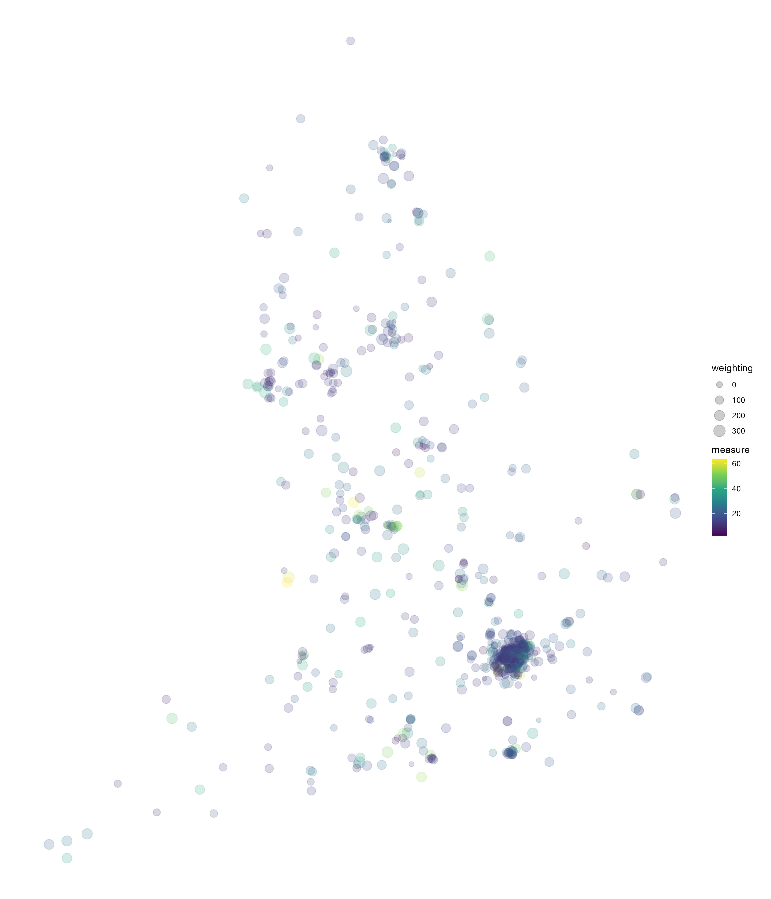
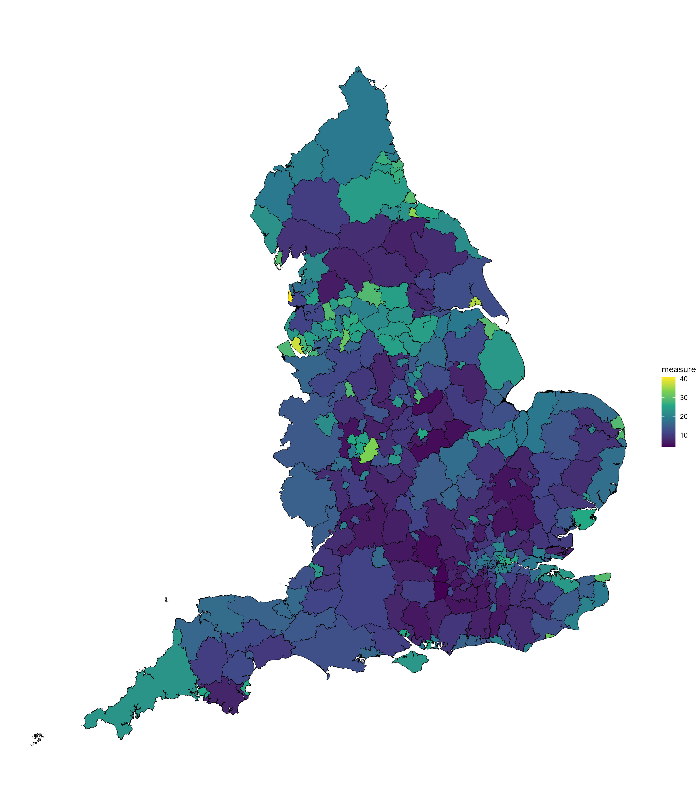
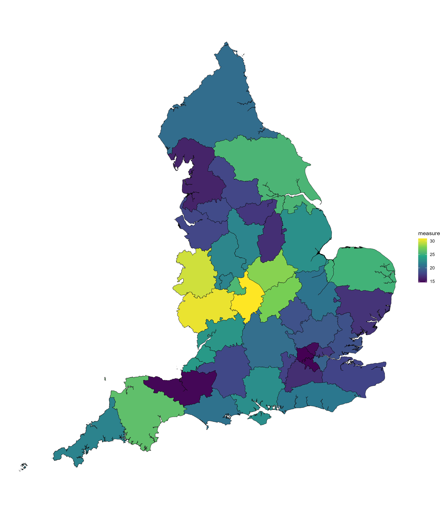

In the walkthrough below, we'll convert data from postcode level, to latitude and longitude, to shapefile areas, and finally from one shapefile to another.
\
\
```{r message=FALSE, warning=FALSE}
options(pkgType = "binary")
if (!require("pacman")) install.packages("pacman")

p_load(
  here, # File path referencing
  dplyr, # General data manipulation
  readr, # Reading data
  stringr, # str_detect()
  ggplot2, # General plotting
  sf, # Geospatial mapping
  PostcodesioR # API wrapper for postcodes.io
)
```
\
Firstly, we'll read in some postcode data.
```{r message=FALSE, warning=FALSE}
measure_postcode <- read_csv(here("1 - Data", "example_data", 
                                  "example_data_postcode.csv")) %>% 
  rename(
    measure = measure_a,
    weighting = measure_b
  )
```
\
We can convert postcode to latitude and longitude with `postcode_lookup()`.
\
This takes about 40s to run with a random sample of 1000 postcodes.
```{r message=FALSE, warning=FALSE}
set.seed(123)

measure_latlong <- measure_postcode %>% 
  sample_n(1000) %>% 
  rowwise() %>%
  mutate(
    lat_long = ifelse(
      is.na(postcode), 
      NA, 
      list(postcode_lookup(postcode)[7:8])
    ),
    lat = unlist(lat_long[1]),
    long = unlist(lat_long[2]),
  ) %>%
  ungroup() %>%
  filter(!is.na(lat_long)) %>%
  st_as_sf(coords = c("lat", "long"), crs = 4326)
```
\
Using new data converted to latitude and longitude, we can plot the points.
```{r}
basic_map_points <- measure_latlong %>%
  ggplot() +
  geom_sf(aes(colour = measure, size = weighting), alpha = 0.2) + 
  theme_void() + 
  scale_colour_viridis_c()

ggsave(basic_map_points, dpi = 300, width = 12, height = 14, units = "in",
       filename = here("2 - Templates", "output_vis", "basic_map_points.jpeg"))
```

\
Next, using the [shape_convert function](https://github.com/DataS-DHSC/geospatial-vis-templates/tree/master/2%20-%20Templates/extra_scripts/shape_convert.R) we can take the points and convert them to Local Authority District (LAD). The contribution of each point to the aggregate measure at LAD level is weighted by our `weighting` column.
```{r warning=FALSE}
shape_lad <- read_sf(here("1 - Data", "shapefiles", "LADs", 
                          "LAD_DEC_2021_UK_BFC.shp")) %>% 
  rename(area_code = LAD21CD)

# Force the points and area crs to match
measure_latlong_match <- measure_latlong %>% 
  st_transform(crs = st_crs(shape_lad)) %>% 
  mutate(area_code = postcode)

source(here("2 - Templates", "extra_scripts", "shape_convert.R"))

measure_lad <- shape_convert(
  old_shape = measure_latlong_match, 
  new_shape = shape_lad, 
  weight = "weighting",
  type = "mean"
  )
```
\
Using new data converted to LADs, we can plot a choropleth map.
```{r}
basic_map_lad <- measure_lad %>%
  filter(str_detect(area_code, "^E")) %>% 
  ggplot() +
  geom_sf(aes(fill = measure)) +
  theme_void() +
  scale_fill_viridis_c()

ggsave(basic_map_lad, dpi = 300, width = 12, height = 14, units = "in",
       filename = here("2 - Templates", "output_vis", "basic_map_lad.jpeg"))
```

\
Finally, we can take the data at LAD level and convert it to Integrated Care Board (ICB) level.
\
Here we will only weight by the % overlap of the areas. This is just an example to show the functionality of `shape_convert()` In practice we could just convert points straight to ICB, or, if we started with areas, we could weight the aggregation by both percent overlap and a weighting column and use `weight = "weighting and overlap"`.
```{r warning=FALSE}
shape_icb <- read_sf(here("1 - Data", "shapefiles", "ICBs", 
                          "Integrated_Care_Boards_(July_2022)_EN_BFC.shp")) %>% 
  rename(area_code = ICB22CD)

measure_icb <- shape_convert(
  old_shape = measure_lad, 
  new_shape = shape_icb, 
  weight = "overlap",
  type = "mean"
  )
```
\
Using new data converted to ICBs, we can plot another choropleth map.
```{r}
basic_map_icb <- measure_icb %>%
  filter(str_detect(area_code, "^E")) %>% 
  ggplot() +
  geom_sf(aes(fill = measure)) +
  theme_void() +
  scale_fill_viridis_c()

ggsave(basic_map_icb, dpi = 300, width = 12, height = 14, units = "in",
       filename = here("2 - Templates", "output_vis", "basic_map_icb.jpeg"))
```


