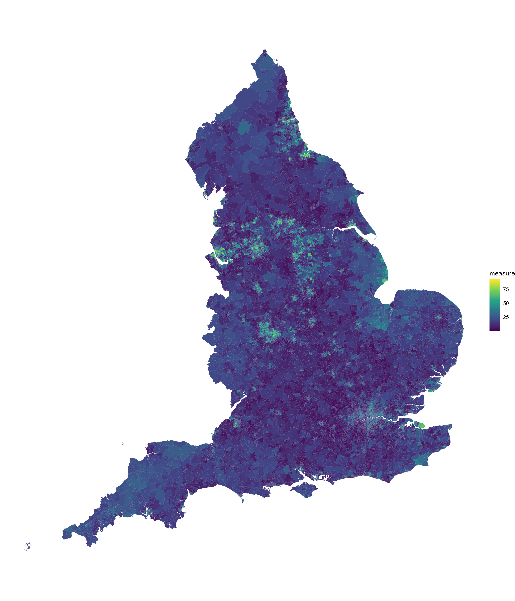

Converting from one area to another
================

In the walkthrough below, we’ll convert IMD data from Lower Layer Super
Output Area (LSOA) level to Local Authority District (LAD) level. The
aggregated IMD score for LADs will be weighted by both the percentage
overlap and the total population of each LSOA.  
  

``` r
options(pkgType = "binary")
if (!require("pacman")) install.packages("pacman")

pacman::p_load(
  here, # File path referencing
  dplyr, # General data manipulation
  janitor, # clean_names
  readr, # Reading data
  stringr, # str_detect()
  ggplot2, # General plotting
  sf # Geospatial mapping
)
```

  
Firstly, we’ll read in some IMD data at LSOA level.

``` r
measure_lsoa <- read_csv(here("1 - Data", "example_data", "imd2019_lsoa.csv")) %>% 
  clean_names() %>% 
  rename(
    area_code = lsoa_code_2011,
    measure = index_of_multiple_deprivation_imd_score,
    weighting = total_population_mid_2015_excluding_prisoners
  )
```

  
The shapefile for LSOAs can be read in and joined with our data.

``` r
shape_lsoa <- read_sf(here("1 - Data", "shapefiles", "LSOAs", "Lower_Layer_Super_Output_Areas_(Dec_2011)_Boundaries_Full_Clipped_(BFC)_EW_V3.shp")) %>% 
  rename(area_code = LSOA11CD)

measure_lsoa_shape <- left_join(shape_lsoa, measure_lsoa, by = "area_code")
```

  
We can now plot a choropleth map of all LSOAs.

``` r
basic_map_lsoa <- measure_lsoa_shape %>%
  filter(str_detect(area_code, "^E")) %>% # England only
  ggplot() +
  geom_sf(
    aes(fill = measure),
    colour = NA
  ) +
  theme_void() +
  scale_fill_viridis_c()

ggsave(basic_map_lsoa, dpi = 300, width = 12, height = 14, units = "in",
       filename = here("2 - Templates", "output_vis", "basic_map_lsoa.jpeg"))
```

  
Next, using the [shape\_convert
function](https://github.com/DataS-DHSC/geospatial-vis-templates/tree/master/2%20-%20Templates/extra_scripts/shape_convert.R)
we can take the LSOAs and convert them to LADs. The aggregated IMD score
for LADs will be weighted by both the `weighting` column and the
percentage overlap of each area.

``` r
shape_lad <- read_sf(here("1 - Data", "shapefiles", "LADs", "LAD_DEC_2021_UK_BFC.shp")) %>% 
  rename(area_code = LAD21CD)

source(here("2 - Templates", "extra_scripts", "shape_convert.R"))

measure_lad <- shape_convert(
  old_shape = measure_lsoa_shape, 
  new_shape = shape_lad,
  weight = "weighting and overlap",
  type = "mean"
  )
```

  
Using new data converted to ICBs, we can plot a choropleth map. We can
also avoid showing some ICB areas made up of a small number of area
using the `count_overlap` column provided by the `shape_convert`
function.

``` r
basic_map_lad <- measure_lad %>%
  filter(str_detect(area_code, "^E")) %>% # England only
  mutate(measure = ifelse(count_overlap >= 10, measure, NA)) %>% # at least 10 areas
  ggplot() +
  geom_sf(
    aes(fill = measure),
    colour = "black",
    size = 0.1
  ) +
  theme_void() +
  scale_fill_viridis_c()

ggsave(basic_map_lad, dpi = 300, width = 12, height = 14, units = "in",
       filename = here("2 - Templates", "output_vis", "basic_map_lad.jpeg"))
```


