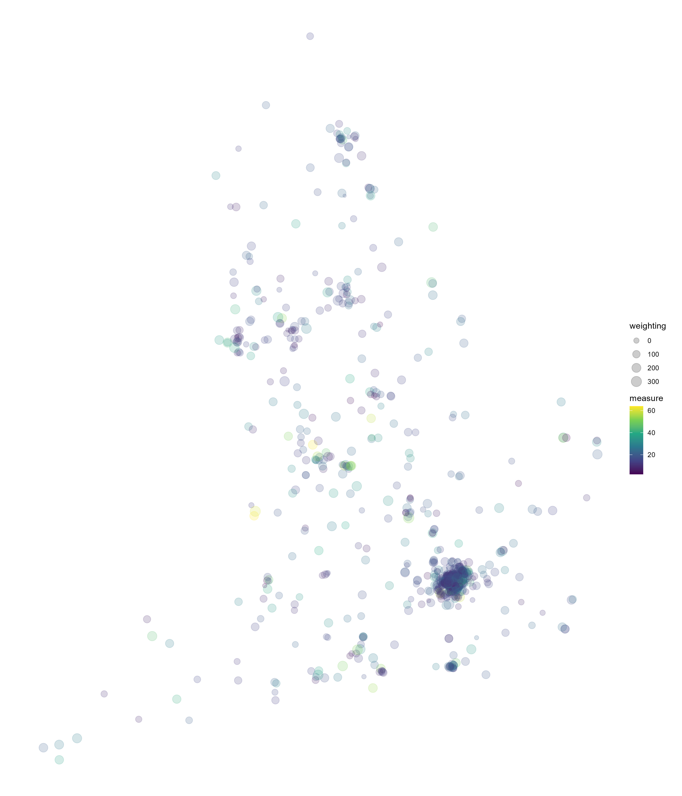
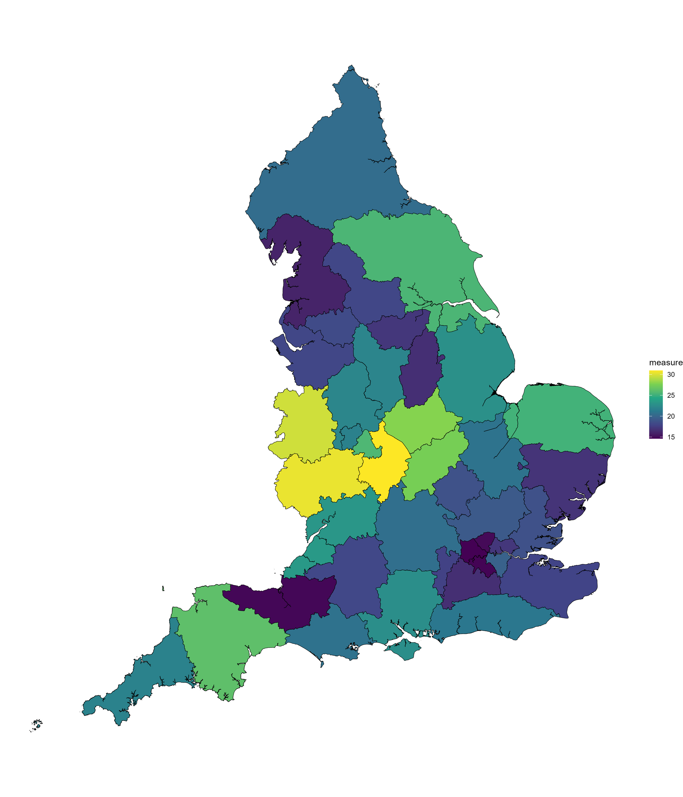

Converting postcodes to points and areas
================

In the walkthrough below, we’ll convert data from postcode level, to
latitude and longitude, and finally to geographic areas.  
  

``` r
options(pkgType = "binary")
if (!require("pacman")) install.packages("pacman")

pacman::p_load(
  here, # File path referencing
  dplyr, # General data manipulation
  readr, # Reading data
  stringr, # str_detect()
  ggplot2, # General plotting
  sf, # Geospatial mapping
  PostcodesioR # API wrapper for postcodes.io
)
```

  
Firstly, we’ll read in some postcode data.  
The `weighting` column will be explained later.

``` r
measure_postcode <- read_csv(here("1 - Data", "example_data", 
                                  "example_data_postcode.csv")) %>% 
  rename(
    measure = measure_a,
    weighting = measure_b
  )
```

  
We can convert postcode to latitude and longitude with
`postcode_lookup()`.  
This takes about 40s to run with a random sample of 1000 postcodes.

``` r
set.seed(123)

measure_latlong <- measure_postcode %>% 
  sample_n(1000) %>% 
  rowwise() %>%
  mutate(
    lat_long = ifelse(
      is.na(postcode), 
      NA, 
      list(postcode_lookup(postcode)[7:8])
    ),
    lat = unlist(lat_long[1]),
    long = unlist(lat_long[2]),
  ) %>%
  ungroup() %>%
  filter(!is.na(lat_long)) %>%
  st_as_sf(coords = c("lat", "long"), crs = 4326)
```

  
Using new data converted to latitude and longitude, we can plot the
points.

``` r
basic_map_points <- measure_latlong %>%
  ggplot() +
  geom_sf(
    aes(
      colour = measure, 
      size = weighting
    ), 
    alpha = 0.2) + 
  theme_void() + 
  scale_colour_viridis_c()

ggsave(basic_map_points, dpi = 300, width = 12, height = 14, units = "in",
       filename = here("2 - Templates", "output_vis", "basic_map_points.jpeg"))
```

  
Next, using the [shape\_convert
function](https://github.com/DataS-DHSC/geospatial-vis-templates/tree/master/2%20-%20Templates/extra_scripts/shape_convert.R)
we can take the points and convert them to Integrated Care Boards
(ICBs). The contribution of each point to the aggregate measure at ICB
level is weighted by our `weighting` column.

``` r
shape_icb <- read_sf(here("1 - Data", "shapefiles", "ICBs", 
                          "Integrated_Care_Boards_(July_2022)_EN_BFC.shp")) %>% 
  rename(area_code = ICB22CD)

# Force the points and area crs to match
measure_latlong_match <- measure_latlong %>% 
  st_transform(crs = st_crs(shape_icb)) %>% 
  mutate(area_code = postcode)

source(here("2 - Templates", "extra_scripts", "shape_convert.R"))

measure_icb <- shape_convert(
  old_shape = measure_latlong_match, 
  new_shape = shape_icb, 
  weight = "weighting",
  type = "mean"
  )
```

  
Using new data converted to ICBs, we can plot a choropleth map. We can
also avoid showing some ICB areas made up of a small number of points
using the `count_overlap` column provided by the `shape_convert`
function.

``` r
basic_map_icb <- measure_icb %>%
  filter(str_detect(area_code, "^E")) %>% # England only
  mutate(measure = ifelse(count_overlap >= 5, measure, NA)) %>% # at least 5 points
  ggplot() +
  geom_sf(
    aes(fill = measure),
    colour = "black",
    size = 0.1
  ) +
  theme_void() +
  scale_fill_viridis_c()

ggsave(basic_map_icb, dpi = 300, width = 12, height = 14, units = "in",
       filename = here("2 - Templates", "output_vis", "basic_map_icb.jpeg"))
```


