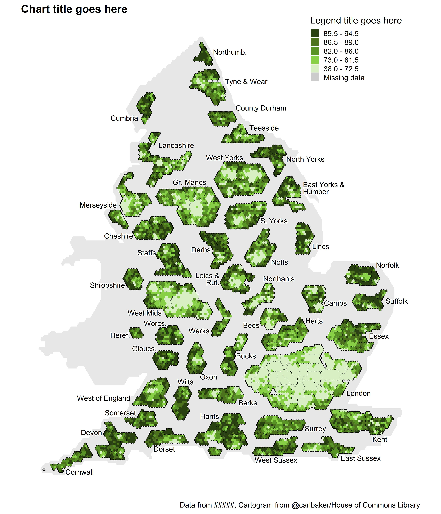

The code below can be used to create a static non-contiguous ("exploded") hexagon-based cartogram of MSOAs in England. [Read more here.](https://github.com/houseofcommonslibrary/uk-hex-cartograms-noncontiguous)
\
\
The :red_circle: symbol is used where you may need to edit code, download something, or make a choice before running the next code chunk.
\
\
Firstly, install and load the following packages.
```{r message=FALSE, warning=FALSE}
options(pkgType = "binary")
if (!require("pacman")) install.packages("pacman")

pacman::p_load(
  here,       # File path referencing
  readr,      # Reading data
  curl,       # Reading data from url
  janitor,    # Rounding
  dplyr,      # General data manipulation
  tidyr,      # More general data manipulation
  ggplot2,    # General plotting
  sf,         # Geospatial mapping
  scales,     # Commas for legend
  stringr,    # str_detect()
  shadowtext  # For outline around text to meet contrast guidelines
)
```
\
:red_circle: Write your own code to read in your data into a tibble called `df_measure` that includes the two columns `area_code` and `measure`. 
\
In this example, I read coronavirus vaccination data from a csv. You may read your data in from an excel file, api, or something else.
```{r message=FALSE, warning=FALSE}
msoa_measure <- read_csv(here("1 - Data", "example_data", "example_data_msoa.csv"))
```
\
The following code downloads and reads in several geospatial layers from a geopackage (MSOA.gpkg) for non-contiguous cartogram at MSOA (2011) level. MSOAs from 2021 are available (MSOA_2021.gpkg) but our example data is from 2011. 
```{r warning=FALSE, results='hide'}
msoa_shape_gpkg <- tempfile()

source <- ("https://github.com/houseofcommonslibrary/uk-hex-cartograms-noncontiguous/raw/main/geopackages/MSOA.gpkg")

msoa_shape_gpkg <- curl_download(
  url = source, 
  destfile = msoa_shape_gpkg, 
  quiet = FALSE
)

msoa_group_labels_s <- st_read(msoa_shape_gpkg, layer = "1 Group labels") %>% 
  mutate(
    Group.labe = case_when(
      Group.labe == "East Yorks & Humber" ~ "East Yorks &\nHumber",
      Group.labe == "Leics &\\Rut." ~ "Leics &\nRut.",
      TRUE ~ as.character(Group.labe)
    ),
    just = if_else(LabelPosit == "Left", 0, 1)
  )

msoa_group_labels <- msoa_group_labels_s %>% 
  st_coordinates(geom) %>% 
  as_tibble() %>% 
  bind_cols(msoa_group_labels_s %>% st_drop_geometry())

msoa_group <- st_read(msoa_shape_gpkg, layer = "2 Groups")

msoa_la <- st_read(msoa_shape_gpkg, layer = "3 Local authority outlines (2019)")

msoa_shape <- st_read(msoa_shape_gpkg, layer = "4 MSOA hex")

msoa_background <- st_read(msoa_shape_gpkg, layer = "MSOA 5 Background")
```
\
We finally join the hexagons with our data to make `msoa_measure_shape`.
```{r}
msoa_measure_shape <- msoa_shape %>% 
  left_join(msoa_measure, by = c("msoa11cd" = "area_code"))
```
\
Now we need to make the `fill_grouped` column to split the measure into groups for the fill legend...
\
\
:red_circle: **If your measure is continuous or count data**, you can use the [scale_quintile function](https://github.com/DataS-DHSC/geospatial-vis-templates/tree/master/2%20-%20Templates/extra_scripts/scale_quintile.R) which automatically generates quintiles for the fill legend. Choose the `round_to` and `decimal_places` values depending on the type of data you're using.
```{r}
source(here("2 - Templates", "extra_scripts", "scale_quintile.R"))

msoa_grouped <- msoa_measure_shape %>% 
  scale_quintile(
    measure = measure, # Name of column containing our measure
    round_to = 0.5,    # Denomination to round to
    decimal_places = 1 # Decimal places to round to (0 for count data)
  )

fill_palette <- c(
  "#294011", # 80-100th percentile
  "#4C721D", # 60-80th percentile
  "#589325", # 40-60th percentile
  "#88D147", # 20-40th percentile
  "#D7EFC3", # 0-20th percentile
  "grey80"   # Missing data
  )

names(fill_palette) <- levels(msoa_grouped$fill_grouped)
fill_scale_final <- scale_fill_manual(values = fill_palette)

# Check legend labels look correct
fill_palette
```
\
:red_circle: **If your measure is already grouped into categories**, call the tibble `df_grouped`, name the category column `fill_grouped`, make sure to call any NAs "Missing data", make it an ordered factor with "Missing data" at the end, and edit the hexadecimal colour codes in `fill_palette` to suit. The number of colours must match the number of categories in `fill_grouped`, including missing data.
\
Your code may look something like this. In this example, we skip this code chunk.
```{r, eval=FALSE, echo=TRUE}
df_grouped <- df_measure_shape %>% 
  mutate(
    fill_grouped = factor(
      ifelse(!is.na(measure), measure, "Missing data"),
      levels = c("High", "Medium", "Low", "Missing data"),
      ordered = TRUE
    )
  )

fill_palette <- c(
  "#294011", # High
  "#589325", # Medium
  "#D7EFC3", # Low
  "grey80"   # Missing data
  )

names(fill_palette) <- levels(df_grouped$fill_grouped)
fill_scale_final <- scale_fill_manual(values = fill_palette)

# Check legend labels look correct
fill_palette
```
\
Now it's time to plot a cartogram of England.
\
:red_circle: You can change the text in `labs()` and change the file name in `ggsave()`.
```{r}
p_map <- ggplot() + 
  geom_sf(
    data = msoa_background, 
    aes(geometry = geom),
    fill = "#e7e7e7",
    colour = NA
  ) + 
  geom_sf(
    data = msoa_grouped %>% filter(str_detect(Lacode, "^E")), 
    aes(geometry = geom, fill = fill_grouped), colour = NA
  ) + 
  geom_sf(
    data = msoa_la %>% filter(str_detect(Lacode, "^E")), 
    aes(geometry = geom), fill = NA, colour = "black", size = 0.2
  ) + 
  geom_sf(
    data = msoa_group %>% filter(Region != "Wales"), 
    aes(geometry = geom), fill = NA, colour = "black"
  ) + 
  geom_shadowtext(
    data = msoa_group_labels %>% filter(RegionNation != "Wales"), 
    aes(X, Y, label = Group.labe, hjust = just), 
    size = 5, colour = "black", bg.colour = "white", 
    lineheight = .8
  ) + 
  fill_scale_final + 
  labs(
    title = str_wrap("Chart title goes here", width = 80),
    fill = str_wrap("Legend title goes here", width = 25),
    caption = str_wrap("Data from #####, Cartogram from @carlbaker/House of Commons Library", width = 80)
  ) + 
  theme_void(base_size = 18, base_family = "sans") +
  theme(
    legend.position = c(0.84, 0.93),
    plot.margin = margin(0, 0, 10, 0),
    plot.title = element_text(face = "bold"),
    plot.title.position = "plot"
  )

ggsave(p_map, dpi = 300, width = 12, height = 14, units = "in",
       filename = here("2 - Templates", "output_vis", "hex_msoa_nc.jpeg"))
```

