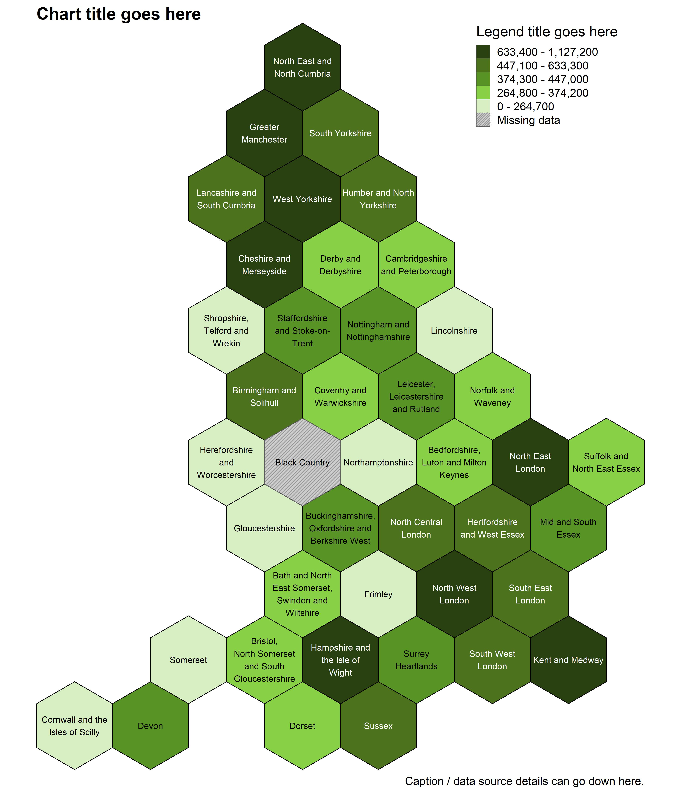

The code below can be used to create a Hexagon-based cartogram of England.
\
\
The :red_circle: symbol is used where you may need to edit code, download something, or make a choice before running the next code chunk.
\
\
Firstly, install and load the following packages.
```{r message=FALSE, warning=FALSE}
options(pkgType = "binary")
if (!require("pacman")) install.packages("pacman")

pacman::p_load(
  here, # File path referencing
  readr, # Reading data
  janitor, # Rounding
  dplyr, # General data manipulation
  tidyr, # More general data manipulation
  ggplot2, # General plotting
  sf, # Geospatial mapping
  scales, # Commas for legend
  stringr, # str_detect()
  knitr, # include_graphics()
  cowplot, # Extra plotting functions
  ggpattern, # Plot patterns for missing data
  geogrid, # Hex cartograms
  geofacet # Hex cartograms
)

df_measure <- read_csv(here("1 - Data/example_data/example_data_icb.csv"))

shape_one <- read_sf(here("1 - Data/shapefiles/ICBs/Integrated_Care_Boards_(July_2022)_EN_BFC.shp")) %>% 
  rename(
    area_code = ICB22CD,
    area_name = ICB22NM
  )

df_measure_shape <- left_join(shape_one, df_measure, by = "area_code")

shape_one_england <- function(df) {df %>% filter(str_detect(area_code, "^E"))}

df_measure_shape %>% 
  tibble() %>% 
  shape_one_england %>% 
  filter(is.na(measure)) %>% 
  select(area_code, measure)

source(here("2 - Templates", "extra_scripts", "scale_quintile.R"))

df_grouped <- df_measure_shape %>% 
  scale_quintile(
    measure = measure, # Name of column containing our measure
    round_to = 100, # Denomination to round to
    decimal_places = 0 # Decimal places to round to (0 for count data)
  )

# Check legend labels look correct
levels(df_grouped$fill_grouped)

fill_palette <- c(
  "#294011", # Q5 (Highest values)
  "#4C721D", # Q4
  "#589325", # Q3
  "#88D147", # Q2
  "#D7EFC3", # Q1 (Lowest values)
  "grey80" # For missing data
)

names(fill_palette) <- levels(df_grouped$fill_grouped)
fill_scale_final <- scale_fill_manual(
  values = fill_palette,
  guide = guide_legend(override.aes = list(pattern = "none"))
)

boundary_colour <- "black"

# Labels for ICBs
df_grouped <- df_grouped %>%
  mutate(
    icb_label = str_remove_all(
      area_name,
      paste(c("^NHS ", " Integrated Care Board"), collapse = "|") # ",", "the", "and"
    )
  ) %>% 
  shape_one_england() %>% 
  st_as_sf()

# Hex map, note that assign_polygons() can take a while to run.
# Only use if less than 500 areas. I.e. not for MSOA, or LSOA.

new_cells_hex <- calculate_grid(
  shape = df_grouped,
  grid_type = "hexagonal", 
  seed = 3
)
# plot(new_cells_hex)

df_grouped_hex <- assign_polygons(
  shape = df_grouped,
  new_polygons = new_cells_hex
)

p_map_hex <- df_grouped_hex %>%
  ggplot() +
  geom_sf(
    aes(fill = fill_grouped),
    colour = boundary_colour
  ) +
  geom_sf_pattern(
    data = . %>% filter(fill_grouped == "Missing data"),
    aes(fill = fill_grouped),
    pattern_colour = "grey60",
    pattern_fill = "grey60",
    pattern_density = 0.0004,
    pattern_spacing = 0.004,
    pattern_angle = 45,
    pattern_res = 300
  ) +
  geom_sf_text(aes(
    label = str_wrap(icb_label, width = 16),
    colour = fill_grouped %in% levels(df_grouped_hex$fill_grouped)[3:5] | 
      fill_grouped == "Missing data")
  ) + 
  scale_colour_manual(values = c("white", "black"), guide = "none") + 
  fill_scale_final +
  guides(
    pattern = "none",
    fill = guide_legend(override.aes = list(
      pattern = c("none", "none", "none", "none", "none", "stripe")
    ))) + 
  coord_sf(expand = FALSE, clip = "off") +
  labs(
    title = str_wrap("Chart title goes here", width = 80),
    fill = str_wrap("Legend title goes here", width = 25),
    caption = str_wrap("Caption / data source details can go down here.", width = 80)
  ) + 
  theme_void(base_size = 18, base_family = "sans") +
  theme(
    legend.position = c(0.84, 0.93),
    plot.margin = margin(0, 10, 10, 10),
    plot.title = element_text(face = "bold"),
    plot.title.position = "plot"
  )


ggsave(p_map_hex, dpi = 300, width = 12, height = 14, units = "in",
       filename = here("2 - Templates/output_vis/choropleth_2area_hex.jpeg"))

```

