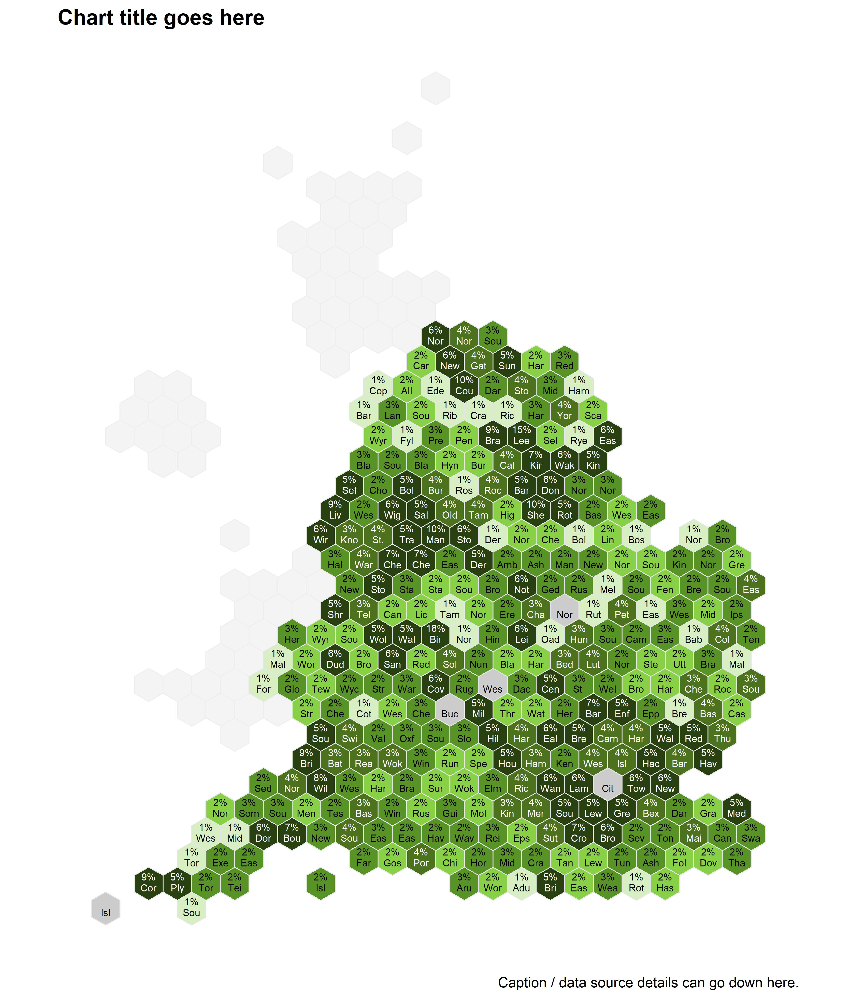

Hex cartogram of LADs in England
================

The code below can be used to create a static hexagon-based cartogram of
Local Authority Districts (LAD) in England.  
  
The :red\_circle: symbol is used where you may need to edit code,
download something, or make a choice before running the next code
chunk.  
  
Firstly, install and load the following packages.

``` r
options(pkgType = "binary")
if (!require("pacman")) install.packages("pacman")

pacman::p_load(
  here,        # File path referencing
  readr,       # Reading data
  janitor,     # Rounding
  dplyr,       # General data manipulation
  tidyr,       # More general data manipulation
  ggplot2,     # General plotting
  sf,          # Geospatial mapping
  scales,      # Commas for legend
  stringr,     # str_detect()
  knitr,       # include_graphics()
  cowplot,     # Extra plotting functions
  geojsonio,   # Reading in geojson files
  savonliquide # contrast ratio checker
)
```

  
:red\_circle: Write your own code to read in your data into a tibble
called `lad_measure` that includes the three columns `area_code`,
`area_name` and `measure`.  
In this example, I read in coronavirus vaccination data from a csv. You
may read your data in from an excel file, api, or something else.

``` r
lad_measure <- read_csv(here("1 - Data", "example_data", "example_data_lad_2.csv"))
```

  
Read in the hexagon GeoJSON file for UK LADs (2021) from
[open-innovations.org](https://open-innovations.org/projects/hexmaps/),
then join it with our data.

``` r
lad_shape <- geojson_read(here("1 - Data", "shapefiles", "LADs", "hex_lad.geojson"),
                          what = "sp") %>% 
  st_as_sf() %>% 
  mutate(
    area_code = id,
    area_name = n
  ) %>% 
  select(area_code, area_name, geometry)

lad_measure_shape <- lad_shape %>% 
  left_join(lad_measure, by = "area_code")
```

  
Now we need to make the `fill_grouped` column to split the measure into
groups for the fill legend…  
  
:red\_circle: **If your measure is continuous or count data**, you can
use the [scale\_quintile
function](https://github.com/DataS-DHSC/geospatial-vis-templates/tree/master/2%20-%20Templates/extra_scripts/scale_quintile.R)
which automatically generates quintiles for the fill legend. Choose the
`round_to` and `decimal_places` values depending on the type of data
you’re using.

``` r
source(here("2 - Templates", "extra_scripts", "scale_quintile.R"))

lad_grouped <- lad_measure_shape %>% 
  scale_quintile(
    measure = measure, # Name of column containing our measure
    round_to = 0.5,    # Denomination to round to
    decimal_places = 1 # Decimal places to round to (0 for count data)
  )

fill_palette <- c(
  "#294011", # 80-100th percentile
  "#4C721D", # 60-80th percentile
  "#589325", # 40-60th percentile
  "#88D147", # 20-40th percentile
  "#D7EFC3", # 0-20th percentile
  "#CCCCCC"   # Missing data
  )

names(fill_palette) <- levels(lad_grouped$fill_grouped)
fill_scale_final <- scale_fill_manual(values = fill_palette)

# Check legend labels look correct
fill_palette
```

    ##   4.5 - 18.5    3.0 - 4.0    2.0 - 2.5    1.5 - 1.5    0.5 - 1.0 Missing data 
    ##    "#294011"    "#4C721D"    "#589325"    "#88D147"    "#D7EFC3"    "#CCCCCC"

  
:red\_circle: **If your measure is already grouped into categories**,
call the tibble `lad_grouped`, name the category column `fill_grouped`,
make sure to call any NAs “Missing data”, make it an ordered factor with
“Missing data” at the end, and edit the hexadecimal colour codes in
`fill_palette` to suit. The number of colours must match the number of
categories in `fill_grouped`, including missing data.  
Your code may look something like this. In this example, we skip this
code chunk.

``` r
lad_grouped <- lad_measure_shape %>% 
  mutate(
    fill_grouped = factor(
      ifelse(!is.na(measure), measure, "Missing data"),
      levels = c("High", "Medium", "Low", "Missing data"),
      ordered = TRUE
    )
  )

fill_palette <- c(
  "#294011", # High
  "#589325", # Medium
  "#D7EFC3", # Low
  "#CCCCCC"   # Missing data
  )

names(fill_palette) <- levels(lad_grouped$fill_grouped)
fill_scale_final <- scale_fill_manual(values = fill_palette)

# Check legend labels look correct
fill_palette
```

  
To follow colour accessibility guidelines regarding text on a coloured
background, we must use white or black text labels depending on which
contrast ratio is best.

``` r
lad_grouped_colour <- lad_grouped %>% 
  st_drop_geometry() %>% 
  mutate(hex_colour = fill_palette[match(fill_grouped, names(fill_palette))]) %>% 
  rowwise() %>% 
  mutate(
    cr_white = as.numeric(check_contrast_raw("#ffffff", hex_colour)$ratio),
    cr_black = as.numeric(check_contrast_raw("#000000", hex_colour)$ratio),
    label_colour = ifelse(cr_white > cr_black, "white", "black")
  ) %>% 
  ungroup() %>% 
  select(area_code, hex_colour, label_colour) %>% 
  left_join(lad_grouped, by = "area_code")
```

  
:red\_circle: Choose the symbol prefix/suffix for the labels with
`symbol_before` and `symbol_after`, plus how many decimal places to
round the measure to with `round_to`.

``` r
symbol_before <- ""
symbol_after <- "%"
round_to <- 0

lad_grouped_colour_lab <- lad_grouped_colour %>%
  mutate(
    label_p = ifelse(
      fill_grouped == "Missing data", "",
      paste0(symbol_before, round(measure, round_to), symbol_after, "\n")
    ),  
    label_n = substr(area_name, start = 1, stop = 3),
  ) %>% 
  select(
    area_code, 
    area_name,
    measure,
    label_p,
    label_n,
    label_colour,
    hex_colour,
    geometry
  )
```

  
Now it’s time to plot a hex cartogram of England.  
:red\_circle: You can change the text in `labs()` and change the file
name in `ggsave()`.

``` r
p_map <- lad_grouped_colour_lab %>% 
  filter(str_detect(area_code, "^E")) %>% 
  ggplot() + 
  geom_sf(
    data = lad_shape,
    fill = "#f4f4f4", colour = "#eeeeee"
  ) + 
  geom_sf(
    aes(geometry = geometry, fill = hex_colour),
    colour = "grey90"
  ) + 
  geom_sf_text(
    aes(geometry = geometry, label = label_p, colour = label_colour), 
    size = 3.5
  ) + 
  geom_sf_text(
    aes(geometry = geometry, label = label_n, colour = label_colour), 
    nudge_y = -0.0004, size = 3.5
  ) + 
  labs(
    title = str_wrap("Chart title goes here", width = 80),
    fill = str_wrap("Legend title goes here", width = 25),
    caption = str_wrap("Caption / data source details can go down here.", width = 80)
  ) + 
  scale_fill_identity() + 
  scale_colour_identity() + 
  theme_void(base_size = 18, base_family = "sans") + 
  theme(
    legend.position = "none",
    plot.margin = margin(0, 10, 10, 10),
    plot.title = element_text(face = "bold"),
    plot.title.position = "plot"
    )

ggsave(p_map, dpi = 300, width = 12, height = 14, units = "in",
       filename = here("2 - Templates", "output_vis", "hex_lad.jpeg"))
```


